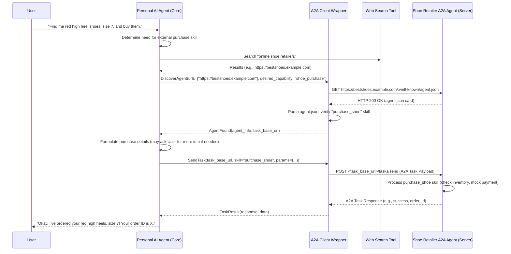

# High-Level Design: A2A Interaction for Shoe Purchase

## 1. Introduction & Scenario

This document outlines a high-level design for a demonstration where a user interacts with their personal AI agent to find and purchase shoes. The personal AI agent, if unable to fulfill the request directly, will leverage the Agent-to-Agent (A2A) protocol to discover and interact with an external "Shoe Retailer A2A Agent" capable of handling the purchase.

**User Goal:** To purchase a specific type of shoe through their personal AI agent.
**Demonstration Goal:** To showcase autonomous A2A discovery and task execution for a simulated e-commerce transaction.

## 2. System Components & Roles

1.  **Personal AI Agent (Client-Side Core):**
    *   **Description:** The user's primary conversational interface (e.g., an agent built with OpenAI Assistants SDK).
    *   **Responsibilities:** Understands user's natural language queries, manages conversation state, utilizes its own tools (like web search), and decides when to invoke external A2A capabilities.
2.  **A2A Client Wrapper (Client-Side Logic):**
    *   **Description:** A Python module/library integrated with the Personal AI Agent. It utilizes the `python-a2a` SDK.
    *   **Responsibilities:** Handles the A2A protocol specifics: discovering external A2A agents based on candidate URLs, parsing agent cards, matching skills, formatting and sending A2A task requests, and processing responses.
    *   **Proposed File Name:** `a2a_client_utils.py`
3.  **Shoe Retailer A2A Agent (Server-Side):**
    *   **Description:** An external A2A-compliant service provided by a hypothetical shoe retailer.
    *   **Responsibilities:** Exposes its capabilities via an `agent.json` card, receives A2A task requests (e.g., to find and purchase shoes), executes these tasks (e.g., checks inventory, simulates payment, confirms order), and returns results/status.
    *   **Hosted Infrastructure (Example):** Similar to the Urmston Town setup (Elastic Beanstalk, API Gateway, CloudFront).

## 3. High-Level Interaction Flow



## 4. Detailed Step-by-Step Breakdown

### 4.1. User Interaction & Initial Processing (Personal AI Agent)

1.  **Example User Query:** `"Find me red high heel shoes, size 7, and see if I can buy them."`
2.  **Personal Agent's Prompt Snippet (Illustrative):**
    ```
    You are a helpful shopping assistant.
    Your primary goal is to fulfill user requests using your available tools.
    If a user asks to purchase a product, and you do not have a direct purchasing tool, you should:
    1. Identify the type of product and key attributes (e.g., item, color, size).
    2. Use your Web Search tool to find potential online retailers for such products.
    3. For each promising retailer URL found, use the 'invoke_a2a_discovery' function to check if they have an A2A agent that supports a skill related to product searching or purchasing.
    4. If a suitable A2A agent and skill are found, use the 'invoke_a2a_task' function to make the purchase.
    ```
3.  **Web Search:** The Personal AI Agent uses its Web Search tool with a query like "online shoe retailers" or "buy red high heels size 7". It receives a list of candidate URLs, e.g., `["https://bestshoes.example.com", "https://shoeworld.example.org"]`.

### 4.2. A2A Discovery (A2A Client Wrapper - `a2a_client_utils.py`)

1.  **Invocation:** The Personal AI Agent calls a function in `a2a_client_utils.py`, e.g., `find_suitable_a2a_agent(candidate_urls, desired_capability_description="shoe purchase")`.
2.  **Process:**
    *   The wrapper iterates through `candidate_urls`.
    *   For each `base_url` (e.g., `https://bestshoes.example.com`):
        *   It calls `await A2AClient.get_client_from_agent_card_url(http_client, base_url)` (from `python-a2a` SDK). This SDK function internally constructs and GETs `https://bestshoes.example.com/.well-known/agent.json`.
        *   **If successful (HTTP 200, valid JSON card):** The wrapper inspects the parsed `agent_card.capabilities.skills` list. It looks for a skill whose `name`, `description`, or `tags` indicate a capability for "shoe purchase" or "product order".
        *   **If failed (404, error, no suitable skill):** It tries the next URL.
3.  **Return to Personal Agent:**
    *   If a suitable agent is found (e.g., `bestshoes.example.com` has a relevant skill), the wrapper returns information like the A2A client instance, the discovered agent's tasking `base_url`, and details of the matched skill.
    *   If no suitable agent is found, it returns `None` or an empty list.

### 4.3. Shoe Retailer's Agent Card (`agent.json`) Example

Served at `https://bestshoes.example.com/.well-known/agent.json`:
```json
{
  "id": "urn:bestshoes:agent:shop",
  "name": "BestShoes Online Retail Agent",
  "version": "1.1.0",
  "description": "A2A agent for finding and purchasing shoes from BestShoes.",
  "base_url": "https://api.bestshoes.example.com/a2a/v1", // Could be different from discovery URL
  "authentication": {
    "type": "oauth2_client_credentials", // Example, could be "none" for demo
    "token_url": "https://auth.bestshoes.example.com/token",
    "scopes_supported": ["read_products", "write_orders"]
  },
  "capabilities": {
      "streaming": false,
      "pushNotifications": false
  },
  "skills": [
    {
      "id": "find_and_purchase_shoe_v1",
      "name": "FindAndPurchaseShoe",
      "description": "Finds a shoe based on criteria and initiates a purchase if available.",
      "tags": ["ecommerce", "shoes", "purchase", "order"],
      "parameters": {
        "type": "object",
        "properties": {
          "shoe_type": {"type": "string", "description": "e.g., high heels, sneakers, boots"},
          "color": {"type": "string", "description": "e.g., red, black"},
          "size": {"type": "string", "description": "e.g., 7, 8.5, 42"},
          "quantity": {"type": "integer", "default": 1},
          "user_context": { // Placeholder for user/session info
            "type": "object",
            "properties": {
              "user_id": {"type": "string"},
              "shipping_address_ref": {"type": "string"},
              "payment_method_ref": {"type": "string"}
            },
            "required": ["user_id", "shipping_address_ref", "payment_method_ref"]
          }
        },
        "required": ["shoe_type", "color", "size", "user_context"]
      },
      "examples": [
        "Find red high heels in size 7 and proceed to purchase."
      ]
    }
    // Potentially other skills like "check_inventory", "get_order_status"
  ]
}
```

### 4.4. Task Formulation & Request (Personal Agent to `a2a_client_utils.py`)

1.  The Personal AI Agent, having confirmed `BestShoes` can handle the request, might need to interact further with the user to confirm details or retrieve `user_id`, `shipping_address_ref`, `payment_method_ref` (assuming these are pre-configured or obtained securely).
2.  It then instructs the `a2a_client_utils.py` wrapper: `send_a2a_task(task_base_url="https://api.bestshoes.example.com/a2a/v1", skill_id="find_and_purchase_shoe_v1", params={...}, auth_token_if_needed)`.

### 4.5. A2A Task Sending (A2A Client Wrapper - `a2a_client_utils.py`)

1.  The wrapper uses the `python-a2a` SDK's `A2AClient` instance (either the one from discovery or a new one initialized for the tasking `base_url`).
2.  It constructs the `send_message_payload`. For a structured skill call, this payload should ideally indicate the target skill and its parameters. The A2A `Message` object's `parts` array can include a `DataPart` for this:
    ```python
    # Example payload construction in the wrapper
    skill_invocation_data = {
        "skill_id": "find_and_purchase_shoe_v1",
        "parameters": {
            "shoe_type": "high heels",
            "color": "red",
            "size": "7",
            "quantity": 1,
            "user_context": {
                "user_id": "user123",
                "shipping_address_ref": "addr_ref_abc",
                "payment_method_ref": "pay_ref_xyz"
            }
        }
    }
    send_message_payload = {
        "message": {
            "role": "user", # Or "agent" if the personal agent is acting on behalf of user
            "parts": [
                {"type": "text", "text": "User requests shoe purchase: red high heels, size 7."}, # Optional textual summary
                {"type": "data", "mime_type": "application/json", "data": skill_invocation_data}
            ],
            "messageId": uuid4().hex
        }
        # Potentially add sessionId if part of an ongoing interaction
    }
    # If auth is needed, wrapper handles adding Authorization header
    response = await sdk_client.send_message(payload=send_message_payload)
    ```
3.  This results in an HTTP POST to `https://api.bestshoes.example.com/a2a/v1/tasks/send`.

### 4.6. Server-Side Processing (Shoe Retailer A2A Agent)

1.  The Shoe Retailer's `A2AServer` (using `python-a2a` SDK) receives the `tasks/send` request.
2.  The request handler (e.g., `DefaultA2ARequestHandler`) extracts the `message`.
3.  The `AgentExecutor` (custom logic for the shoe agent) receives the message.
4.  It inspects the `message.parts`. If it finds a `DataPart` with the `skill_invocation_data`, it directly knows which skill (`find_and_purchase_shoe_v1`) and parameters to use. (If only text was sent, it would need NLU to map to the skill).
5.  It executes the skill:
    *   Checks inventory for "red high heels, size 7".
    *   Simulates payment using `payment_method_ref`.
    *   Simulates order creation using `shipping_address_ref`.
6.  It constructs an A2A `Task` response (e.g., status `COMPLETED`, result including `order_id` and confirmation, or status `FAILED` with an error message).
7.  The `A2AServer` sends this back as the HTTP response.

### 4.7. Response to User (A2A Client Wrapper to Personal Agent)

1.  The `a2a_client_utils.py` wrapper receives the A2A `Task` response.
2.  It parses this and provides a structured result (e.g., `{"status": "success", "order_id": "SH12345", "message": "Order confirmed."}`) or error information to the Personal AI Agent.
3.  The Personal AI Agent then formulates a natural language response for the user: "Okay, I've ordered your red high heels, size 7! Your order ID is SH12345."

## 5. Proposed Agent & File Setups

### 5.1. Personal AI Agent (Client-Side)

*   **Core Logic File:** `personal_assistant_main.py`
    *   Contains main OpenAI Assistant SDK interaction loop.
    *   Implements prompt engineering to decide when to use A2A.
    *   Calls functions from `a2a_client_utils.py`.
*   **A2A Client Utilities:** `a2a_client_utils.py`
    *   Uses `python-a2a.client.A2AClient`.
    *   `async def find_suitable_a2a_agent(candidate_urls: list[str], desired_skill_description: str, required_params_schema: dict = None) -> Optional[DiscoveredAgentInfo]:`
        *   Loops through URLs, calls `A2AClient.get_client_from_agent_card_url`.
        *   Parses agent card, matches `desired_skill_description` against skill names/tags/descriptions.
        *   Optionally validates `required_params_schema` against skill parameters.
        *   Returns agent info (tasking base_url, skill details, auth info) or None.
    *   `async def send_a2a_task(agent_task_url: str, skill_id: str, skill_params: dict, auth_token: Optional[str] = None) -> A2AResponse:`
        *   Constructs the structured `send_message_payload` with a `DataPart`.
        *   Calls `A2AClient.send_message()`.
        *   Handles response.
*   **Tools Available to Personal Agent:**
    *   Web Search tool.
    *   A "tool" or function that calls `a2a_client_utils.find_suitable_a2a_agent`.
    *   A "tool" or function that calls `a2a_client_utils.send_a2a_task`.

### 5.2. Shoe Retailer A2A Agent (Server-Side)

*   **Project Directory:** `shoe_retailer_a2a_agent/`
*   **Source Directory:** `shoe_retailer_a2a_agent/agent_src/`
    *   `server.py`: FastAPI app, initializes `A2AServer` from `python-a2a.server`.
        *   Defines/serves `agent.json` (or generates it dynamically).
        *   Sets up `DefaultA2ARequestHandler` with a custom `ShoeAgentExecutor`.
    *   `agent_card_definition.py` (or similar): Logic to generate the `agent.json` content (as shown in section 4.3).
    *   `shoe_agent_executor.py`: Implements the `BaseAgentExecutor` interface. Receives messages, extracts skill and params (especially from `DataPart`), and calls appropriate skill logic.
    *   `skills_logic.py`:
        *   `async def find_and_purchase_shoe(shoe_type: str, color: str, size: str, quantity: int, user_context: dict) -> PurchaseResult:`
            *   Contains business logic (check inventory, mock payment, etc.).
    *   `inventory_db.py` (mock): Simulates inventory.
    *   `Dockerfile`, `requirements.txt`, etc.

## 6. Conclusion & Further Considerations

This HLD outlines a robust approach for a personal AI agent to discover and utilize an external A2A agent for a specific task like purchasing shoes. Key elements include:

*   A clear separation of concerns between the personal agent's core reasoning, the A2A client wrapper handling protocol details, and the specialized server-side A2A agent.
*   Using the standard `/.well-known/agent.json` for discovery.
*   Defining explicit skills with parameter schemas in the server agent's card.
*   Sending structured task requests from the client (via `DataPart`) for more reliable skill invocation, rather than relying solely on server-side NLU for every interaction.

**Further considerations for a production system:**
*   **Authentication & Authorization:** Implementing secure methods for the A2A client to authenticate with the Shoe Retailer A2A Agent if `authentication.type` is not "none".
*   **Error Handling:** Comprehensive error handling at each step.
*   **Idempotency:** Ensuring purchase operations are idempotent if retried.
*   **Multi-turn Conversations:** Handling more complex interactions (e.g., clarifying shoe options, confirming shipping details) using A2A's session/context management.
*   **Asynchronous Task Handling:** For long-running tasks, the server would return a `Task` object with `status: PENDING` or `RUNNING`, and the client would use `tasks/get` to poll for completion.
*   **Security of Payment/User Data:** In a real scenario, sensitive data like full payment details would not be passed directly. Instead, references to tokenized payment methods or secure user profiles would be used. 