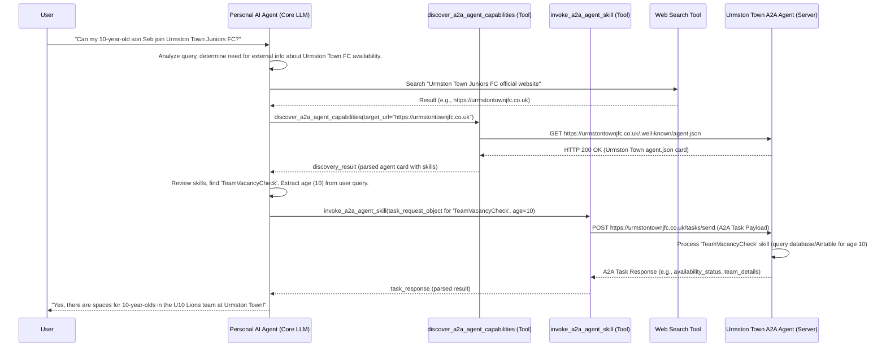

# High-Level Design: A2A Interaction for Urmston Town FC Enquiries

## 1. Introduction & Scenario

This document outlines a high-level design for a demonstration where a user interacts with their general-purpose personal AI agent to inquire about team availability at Urmston Town Juniors FC. The personal AI agent, if unable to answer directly, will leverage the Agent-to-Agent (A2A) protocol to discover and interact with the specialized "Urmston Town A2A Agent."

**User Goal:** To find out if there are spaces for their child at Urmston Town Juniors FC.
**Demonstration Goal:** To showcase autonomous A2A discovery by a general-purpose personal AI agent and task execution with a specialized external A2A agent.

## 2. System Components & Roles

1.  **Personal AI Agent (Client-Side Core):**
    *   **Description:** The user's primary conversational interface (e.g., an agent built with OpenAI Assistants SDK).
    *   **Responsibilities:** Understands user's natural language queries, manages conversation state, utilizes its own tools (like web search and the A2A tools), and decides when and how to invoke external A2A capabilities.
2.  **A2A Client Wrapper Tools (Client-Side Logic):**
    *   **Description:** Python functions/module integrated as tools for the Personal AI Agent. These tools utilize the `python-a2a` SDK.
    *   **Tool 1: `discover_a2a_agent_capabilities(target_url: str) -> discovery_result_object`**
        *   Responsibilities: Given a target website URL, attempts to discover an A2A agent by fetching `/.well-known/agent.json`. Parses the agent card if found and returns structured information about the agent's capabilities (name, description, skills list with their details, tasking base URL).
    *   **Tool 2: `invoke_a2a_agent_skill(task_request_object) -> task_response_object`**
        *   Responsibilities: Given details of a target agent, a specific skill, and parameters, constructs and sends an A2A `tasks/send` request. Processes and returns the response.
    *   **Proposed File Name for Implementations:** `a2a_client_tools.py`
3.  **Urmston Town A2A Agent (Server-Side):**
    *   **Description:** The A2A-compliant service for Urmston Town Juniors FC.
    *   **Responsibilities:** Exposes its capabilities via an `agent.json` card (served at `https://urmstontownjfc.co.uk/.well-known/agent.json`). Receives A2A task requests (e.g., to check team availability), executes these tasks by interacting with club data (e.g., Airtable), and returns results/status.
    *   **Hosted Infrastructure:** AWS Elastic Beanstalk, API Gateway, CloudFront, as detailed in `a2a_discovery_setup.md`.

## 3. High-Level Interaction Flow



## 4. Detailed Step-by-Step Breakdown

### 4.1. User Interaction & Personal AI Agent - Initial Processing

1.  **Example User Query:** `"Can my 10-year-old son Seb join Urmston Town Juniors FC?"`
2.  **Personal AI Agent's System Prompt Snippet (Guiding Principles):**
    ```
    You are a highly capable and resourceful personal assistant. Your primary objective is to understand and fulfill user requests comprehensively and efficiently.

    You have access to a set of primary tools for direct action and information retrieval.

    Additionally, you have the capability to interact with a wider network of specialized, external AI agents through a standardized communication protocol (A2A). These external agents can offer a vast range of specific services, information, or transactional capabilities that extend beyond your own core functions.

    If a user's request implies a need for a specialized service, action, or information that your primary tools cannot directly satisfy:

    1.  **Identify Potential Service Domains:** Determine the type(s) of service or domain expertise required to fulfill the request (e.g., "flight booking," "hotel reservation," "local restaurant information," "currency exchange," "sports club registrations," "product purchasing from a specific retailer," etc.).

    2.  **Discover Candidate Services/URLs:** Use your 'web_search_tool' to find relevant websites or online services that operate within the identified service domain(s). Your goal is to gather a list of their primary website URLs.

    3.  **Probe for A2A Capabilities:** For each promising website URL, you MUST use your 'discover_a2a_agent_capabilities' tool. Provide this tool with the website URL.
        *   This tool will attempt to discover if an A2A-compatible agent exists for that service and will return its advertised capabilities (name, description, and a list of specific skills it offers, including what information each skill requires).

    4.  **Evaluate and Select External Agent/Skill:**
        *   Carefully review the `available_skills` (including their names, descriptions, and parameter requirements) returned by the 'discover_a2a_agent_capabilities' tool for any discovered agents.
        *   Based on your understanding of the user's original request, determine if any discovered agent and its specific skill(s) are a suitable match to help fulfill the request. You may need to assess if you can provide the necessary parameters for a skill.

    5.  **Invoke External Agent Skill (If Suitable Agent/Skill Found):**
        *   If you identify a suitable external agent and skill:
            *   Formulate the necessary input parameters for the chosen skill, drawing information from the user's query and any ongoing conversation context.
            *   Use your 'invoke_a2a_agent_skill' tool, providing it with the necessary details (like the target agent's tasking URL, the specific skill ID you've chosen from its card, and the parameters you've prepared).
        *   Clearly communicate the outcome (success, failure, information received) back to the user.

    6.  **If No Suitable External Agent/Skill is Found:** Inform the user that you couldn't find a specialized automated service for their specific request at this time, and explore alternative ways to assist them or suggest they try a different approach.

    Always prioritize fulfilling the user's request effectively, whether through your own tools or by intelligently leveraging the network of external A2A agents.
    ```
3.  **Query Analysis:** The Personal AI Agent understands the query relates to Urmston Town Juniors FC, a specific age (10), and the intent is to check joining availability.

### 4.2. A2A Discovery (Orchestrated by Personal AI Agent, Executed by Tool)

1.  **Identify Target URL:** The Personal Agent determines the target URL is `https://urmstontownjfc.co.uk` (either through prior knowledge, entity linking, or via its `web_search_tool`).
2.  **Call Discovery Tool:**
    `discovery_outcome = agent.tools.discover_a2a_agent_capabilities(target_url="https://urmstontownjfc.co.uk")`
3.  **`discover_a2a_agent_capabilities` Tool Logic (in `a2a_client_tools.py`):**
    *   Receives `target_url`.
    *   Uses `python-a2a` SDK: `sdk_client = await A2AClient.get_client_from_agent_card_url(http_client, target_url)`.
    *   This internally GETs `https://urmstontownjfc.co.uk/.well-known/agent.json`.
    *   If successful and card is valid, it parses the card.
    *   Returns a structured `discovery_result_object` to the Personal AI Agent:
        ```python
        # Example structure returned by the tool
        {
            "status": "success", # or "not_found", "error"
            "agent_name": "Urmston Town Juniors Orchestrator Agent",
            "agent_description": "A2A Agent for Urmston Town Juniors FC inquiries.",
            "tasking_base_url": "https://urmstontownjfc.co.uk",
            "available_skills": [
                {
                    "id": "check_team_availability_v1",
                    "name": "TeamVacancyCheck",
                    "description": "Checks for available spaces in Urmston Town junior teams based on age.",
                    "parameters_schema": { 
                        "type": "object", 
                        "properties": { "age": {"type": "integer", "description": "Age of the child"} },
                        "required": ["age"]
                    }
                }
                // other skills if any
            ]
        }
        ```
4.  **Personal AI Agent Evaluates Discovery:**
    *   Receives `discovery_outcome`.
    *   If `status == "success"`, it iterates through `available_skills`.
    *   Its LLM capabilities allow it to match the user's intent ("check joining availability for 10-year-old") with the `TeamVacancyCheck` skill's `name` and `description`.
    *   It notes the `tasking_base_url` and the `parameters_schema` for the chosen skill.

### 4.3. Urmston Town FC Agent Card (`agent.json`) Example

Served at `https://urmstontownjfc.co.uk/.well-known/agent.json`:
```json
{
  "id": "urn:urmstontown:agent:orchestrator",
  "name": "Urmston Town Juniors Orchestrator Agent",
  "version": "1.0.1",
  "description": "A2A Agent for Urmston Town Juniors FC inquiries, including team availability.",
  "base_url": "https://urmstontownjfc.co.uk", // Tasking base URL
  "authentication": {
    "type": "none" // For this public-facing skill
  },
  "capabilities": {
      "streaming": false,
      "pushNotifications": false
  },
  "skills": [
    {
      "id": "check_team_availability_v1",
      "name": "TeamVacancyCheck",
      "description": "Checks for available spaces in Urmston Town junior teams based on age.",
      "tags": ["football", "juniors", "availability", "registration", "vacancies"],
      "parameters": {
        "type": "object",
        "properties": {
          "age": {"type": "integer", "description": "Age of the child in years."}
          // Could add other params like 'gender', 'current_team' if relevant
        },
        "required": ["age"]
      },
      "examples": [
        "Is there space for a 10 year old?",
        "Check availability for age 7."
      ]
    }
    // Potentially other skills like "get_match_schedule", "report_issue"
  ]
}
```

### 4.4. Task Formulation & Invocation (Personal AI Agent to `invoke_a2a_agent_skill` Tool)

1.  **Parameter Extraction (by Personal AI Agent):** From the original query `"Can my 10-year-old son Seb join Urmston Town Juniors FC?"`, the Personal AI Agent extracts `age = 10` as per the `parameters_schema` of the `TeamVacancyCheck` skill.
2.  **Call Tasking Tool:**
    `task_outcome = agent.tools.invoke_a2a_agent_skill(task_request_object={
        "task_base_url": "https://urmstontownjfc.co.uk",
        "skill_id": "check_team_availability_v1", // Explicitly chosen skill
        "parameters": {"age": 10},
        "contextual_query_text": "User asked: Can my 10-year-old son Seb join Urmston Town Juniors FC?" // For server-side logging/NLU fallback
    })`

### 4.5. A2A Task Sending (`invoke_a2a_agent_skill` Tool Logic in `a2a_client_tools.py`)

1.  Receives `task_request_object`.
2.  Uses `python-a2a` SDK's `A2AClient`.
3.  **Constructs A2A Payload for `tasks/send`:**
    *   It prioritizes using the structured `skill_id` and `parameters` to create a `DataPart` if the server is expected to handle structured skill calls. A `TextPart` with the `contextual_query_text` can be included for context or as a fallback.
        ```python
        # Example construction
        message_parts = [
            {"type": "text", "text": task_request_object['contextual_query_text']}
        ]
        if task_request_object.get('skill_id') and task_request_object.get('parameters') is not None:
            message_parts.append({
                "type": "data", 
                "mime_type": "application/json", 
                "data": {
                    "skill_id": task_request_object['skill_id'],
                    "parameters": task_request_object['parameters']
                }
            })

        send_message_payload = {
            "message": {
                "role": "user",
                "parts": message_parts,
                "messageId": uuid4().hex
            }
        }
        response = await sdk_client.send_message(payload=send_message_payload)
        ```
4.  Makes HTTP POST to `https://urmstontownjfc.co.uk/tasks/send`.
5.  Returns parsed A2A response (success data or error) as `task_response_object`.

### 4.6. Server-Side Processing (Urmston Town A2A Agent)

1.  Urmston Town's `A2AServer` receives the `tasks/send` request.
2.  The `DefaultA2ARequestHandler` passes the `message` to `UrmstonTownAgentExecutor`.
3.  **`UrmstonTownAgentExecutor` (and `UrmstonTownAgent` logic):**
    *   It inspects `message.parts`. Ideally, it finds the `DataPart` containing `skill_id: "check_team_availability_v1"` and `parameters: {"age": 10}`.
    *   It dispatches to an internal function: `result = internal_check_availability_function(age=10)`.
    *   (If only a `TextPart` was present, or as a fallback, it could use its own NLU on the text to determine intent and extract age).
    *   `internal_check_availability_function` queries the club's actual data source (e.g., Airtable, database).
    *   Example result: `{"has_vacancy": True, "team_name": "U10 Lions", "contact": "coach@example.com"}`.
    *   This result is packaged into an A2A `Task` success response.
4.  The `A2AServer` sends the HTTP response back to the client.

### 4.7. Response to User (Personal AI Agent)

1.  The `invoke_a2a_agent_skill` tool returns the `task_response_object` to the Personal AI Agent.
2.  The Personal AI Agent processes the successful result (e.g., `result_data: {"has_vacancy": True, ...}`).
3.  It formulates a natural language response: `"Good news! There are spaces available for a 10-year-old in the U10 Lions team at Urmston Town. You can contact coach@example.com for more details."`

## 5. Proposed Agent & File Setups (Conceptual)

### 5.1. Personal AI Agent (Client-Side)

*   **Core Logic File (e.g., OpenAI Assistant Setup):** `personal_assistant_orchestrator.py`
    *   Contains main LLM interaction loop, prompt definition, tool registration.
*   **A2A Client Tools Implementation:** `a2a_client_tools.py`
    *   Implements `def discover_a2a_agent_capabilities(...)` and `def invoke_a2a_agent_skill(...)` which use `python-a2a.client.A2AClient`.

### 5.2. Urmston Town A2A Agent (Server-Side - in `urmston_town_chatbot/chatbot_src/`)

*   `server.py`: FastAPI app, initializes `A2AServer` (from `python-a2a.server`).
    *   References `agent_card_definition.get_agent_card()`.
    *   Sets up `DefaultA2ARequestHandler` with `UrmstonTownAgentExecutor`.
*   `agent_card_definition.py`: Contains the `get_agent_card()` function that defines the `agent.json` content dynamically or loads it.
*   `urmston_town_agent_executor.py`: Implements `BaseAgentExecutor`. Receives messages from the A2A handler, extracts skill & params (prioritizing `DataPart`), and calls skill logic.
*   `skills_logic.py` (or `club_data_interface.py`):
    *   `async def check_team_availability(age: int) -> AvailabilityResult:`
        *   Contains business logic to query the actual club database/Airtable.
*   `go.py` (if an orchestrator LLM is used *within* the Urmston Town agent for complex skill fulfillment, but for simple data lookup, `skills_logic.py` might be direct).

## 6. Further Considerations

*   **Error Handling:** Robust error handling is needed at all stages (discovery fails, skill invocation fails, server returns error).
*   **Structured vs. Natural Language Payloads:** While this design allows the Personal AI Agent to choose a specific skill and provide structured parameters (via a `DataPart`), the Urmston Town A2A server should ideally also be capable of basic NLU on the `TextPart` as a fallback or for simpler queries if a `DataPart` isn't provided by the client. This makes the server more versatile.
*   **Authentication:** For skills beyond public information (e.g., actually registering a child), the Urmston Town agent card would specify authentication requirements, and the `invoke_a2a_agent_skill` tool/Personal Agent would need a way to manage/provide credentials. 